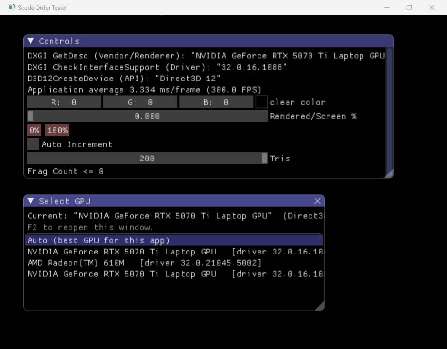

# TriangleBin-DX

English | [中文](README_CN.md)

A Windows port of [TriangleBin](https://github.com/Swung0x48/TriangleBin) to **Direct3D 11 and 12**.

It draws a stack of overlapping triangles and counts how many fragments the GPU actually
shades. That count is what tells you whether your GPU is an **IMR** (immediate-mode
renderer, shades every covered pixel of every triangle) or a **TBR** (tile-based renderer,
bins geometry per tile and shades each pixel roughly once).



## Relationship to the original

This is a port, not a fork in the "small patch" sense. The idea, the controls and the
measurement are taken from [TriangleBin](https://github.com/Swung0x48/TriangleBin) by
Swung 0x48 (MIT); the renderer, the build system and the platform support were rewritten
for DirectX.

| | [TriangleBin](https://github.com/Swung0x48/TriangleBin) | TriangleBin-DX (this repo) |
|---|---|---|
| Graphics API | OpenGL / OpenGL ES | Direct3D 12, falls back to Direct3D 11 |
| Platforms | Android (APK) + Windows x64 | Windows: x86, x64, ARM64 |
| Build system | Gradle + Android NDK | CMake + MSVC |
| GPU selection | — | pick any DXGI adapter at runtime (F2) |
| Failure diagnostics | — | writes a report on startup failure or crash |

## What this port adds

**Automatic API selection.** Direct3D 12 is tried first; if device creation fails the
app falls back to Direct3D 11 and says so in the log. There is no manual override —
the original only offered automatic selection too.

**Select GPU window (F2).** Every hardware DXGI adapter is listed with its driver
version, and marked `(D3D11 only)` when it cannot do D3D12. This matters on laptops
that have both an integrated and a discrete GPU: the adapter that Windows hands out by
default is not always the one you want to measure. `Auto (best GPU for this app)` keeps
the default behaviour. Switching adapters recreates the device, so the UI debounces
rapid clicks into a single switch.

**Diagnostic report.** On a fatal startup error (for example no DirectX 11 capable
device) or an unhandled exception, the app writes `trianglebin-error-report.txt` next
to the executable. It contains the OS version and build number, CPU architecture, GPU
name, driver version, the highest supported DirectX feature level, and the exact error.
Sending that one file back is enough to diagnose most startup crashes.

**Runtime value readout.** The same information the original displayed via
`glGetString(...)` is now labelled with the DirectX call it came from: `DXGI GetDesc`
for the adapter, `DXGI CheckInterfaceSupport` for the driver version, and
`D3D12CreateDevice` / `D3D11CreateDevice` for the device.

**ARM64 support.** The x86, x64 and ARM64 configurations share one source tree. ARM64
links SDL2 statically (`deps/SDL2/lib/arm64/SDL2-static.lib`) because SDL2's shared
library cannot be linked for MSVC ARM64; `src/sdl2_atomic_shim.c` supplies the missing
`_Interlocked*` symbols.

**Single-file launcher.** `tools/launcher` builds one executable with the x64, x86 and
ARM64 payloads embedded as resources. It extracts the build matching the host CPU and
runs it, so a release is a single `.exe` rather than one archive per architecture.

## Controls

| Control | Meaning |
|---|---|
| `Rendered/Screen %` | Fragments rendered / screen pixel count, as a percentage. Range 0–500. |
| `0%` / `100%` | Jump straight to 0% or 100%. |
| `Tris` | Number of random triangles to draw, 0–200. The two fullscreen triangles are not counted. |
| `Auto Increment` | Increase `Rendered/Screen %` automatically every frame. |
| `ppf` | Percent per frame — how much `Rendered/Screen %` grows while Auto Increment is on. Range 0–10. |
| `Frag Count` | Fragments the GPU actually shaded for the current frame. It should stay at or below the requested target. |
| `clear color` | Background colour. |
| `F2` | Open or close the Select GPU window. |

How to read it: raise `Tris` and watch `Frag Count`. If the count keeps climbing with
the triangle count, the GPU is shading every covered pixel of every triangle — that is
IMR behaviour. If it plateaus well below the target, the GPU is binning geometry and
shading each pixel once per tile — that is TBR behaviour.

## Building

Requirements:

- Windows 10 or 11
- Visual Studio 2022 or newer with the **Desktop development with C++** workload
- CMake 3.20 or newer (the copy bundled with Visual Studio works)

SDL2, Dear ImGui and GLM are vendored under `deps/`, so no package manager is needed.

```bash
git clone https://github.com/ddYIbb/TriangleBin-DX.git
cd TriangleBin-DX

cmake -S . -B build-x64 -A x64
cmake --build build-x64 --config Release
```

If several Visual Studio versions are installed and CMake picks the wrong one,
name the generator explicitly with `-G "Visual Studio 17 2022"` (or
`-G "Visual Studio 18 2026"`).

The executable lands in `build-x64/demo-dx.exe`. Copy `deps/SDL2/lib/x64/SDL2.dll` next
to it before running.

The other architectures use the same commands with a different generator platform and
output directory:

```bash
cmake -S . -B build-x86 -A Win32
cmake --build build-x86 --config Release

cmake -S . -B build-arm64 -A ARM64
cmake --build build-arm64 --config Release
```

The ARM64 build links SDL2 statically and therefore needs no `SDL2.dll`.

### Launcher

`tools/launcher` embeds the three executables and the two needed `SDL2.dll` files
as resources. Configure it only after all three builds above have produced their
`demo-dx.exe`, since the resource compiler reads those files at build time:

```bash
cmake -S tools/launcher -B tools/launcher/build -A Win32
cmake --build tools/launcher/build --config Release
```

The result is `tools/launcher/build/demo-dx.exe`, a single portable executable.
It is deliberately built as Win32 so that the one file runs on every Windows
machine: x86 and x64 natively, ARM64 through the built-in emulation.

`launcher.rc.in` is a template — `CMakeLists.txt` fills in the absolute path of
each payload at configure time and writes `launcher.rc` into the build
directory. Nothing machine-specific is stored in the repository.

## Third-party components

| Component | Version | Licence |
|---|---|---|
| [SDL2](https://github.com/libsdl-org/SDL) | 2.30.11 | zlib |
| [Dear ImGui](https://github.com/ocornut/imgui) | — | MIT |
| [GLM](https://github.com/g-truc/glm) | — | MIT |

## Licence

MIT — see [LICENSE](LICENSE).

Based on [TriangleBin](https://github.com/Swung0x48/TriangleBin) by Swung 0x48,
licensed under the MIT Licence. The original copyright notice is preserved in
`LICENSE`.
